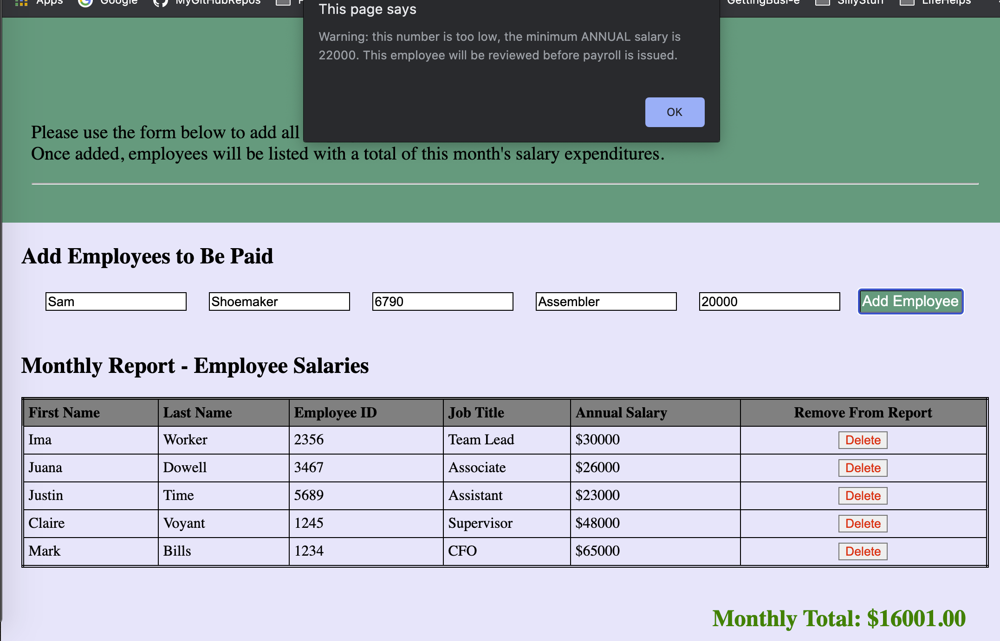
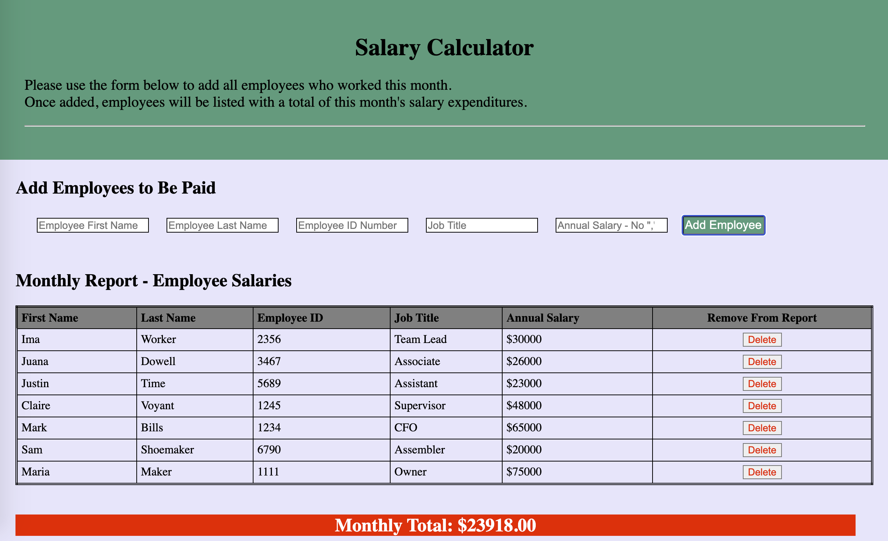

# Prime Learning - Weekend Challenge #1

**Project Title:** jQuery Salary Calculator
**Original date:** 03/14-15/2020
**Duration:** 2 days
**Assignment type:** Solo
**Feedback applied:** Applied \_ naming convention on object properties
**Other changes/enhancements:** Enhanced README.md
**Last modified:** 07/05/2020

## Description

This application assists managers with assessing monthly staff payroll budget status.

If an individual's salary is less than \$22K a low salary warning displays. If the monthly salaries to be paid is above the budgetary threshold of \$20,000, the screen will display a red banner banner containing the grand total.

If an employees is entered into the report in error, managers may also removed employees from the monthly report.

## Screen Shots

#### Basic entry screen, with the current entry triggering the salary too low warning

#### Total monthly salaries exceed threshold

## Build Environment

### Tech

- CSS
- HTML
- JavaScript
- jQuery

### Dev and Collaboration Resources

- Chrome Developer Tools
- GitHub
- Atom

## Original Instructions and Assumptions

For context only - NOTE: some Prime resource access requires affiliation

[Prime jQuery Salary Calculator Instructions](documentation/INSTRUCTIONS.md)

## License

[MIT](./LICENSE.txt)

## Acknowledgement

Thanks to [Prime Digital Academy](https://www.primeacademy.io/) guiding me though the fundamentals of full stack development, providing the Ursus cohort with a solid foundation in modern technologies, and their continued support in our development as software engineers. A secondary thanks to my Ursus cohort peers for their feedback, perspective, collaborations, encouragement, and generously sharing information and resources.

## Feedback, Suggestions, Support

Please reach out to me on LinkedIn if you have comments, ideas, or interest in contributing to this project

- [Nicole Blechynden](https://www.linkedin.com/in/nicoleblechynden/)
